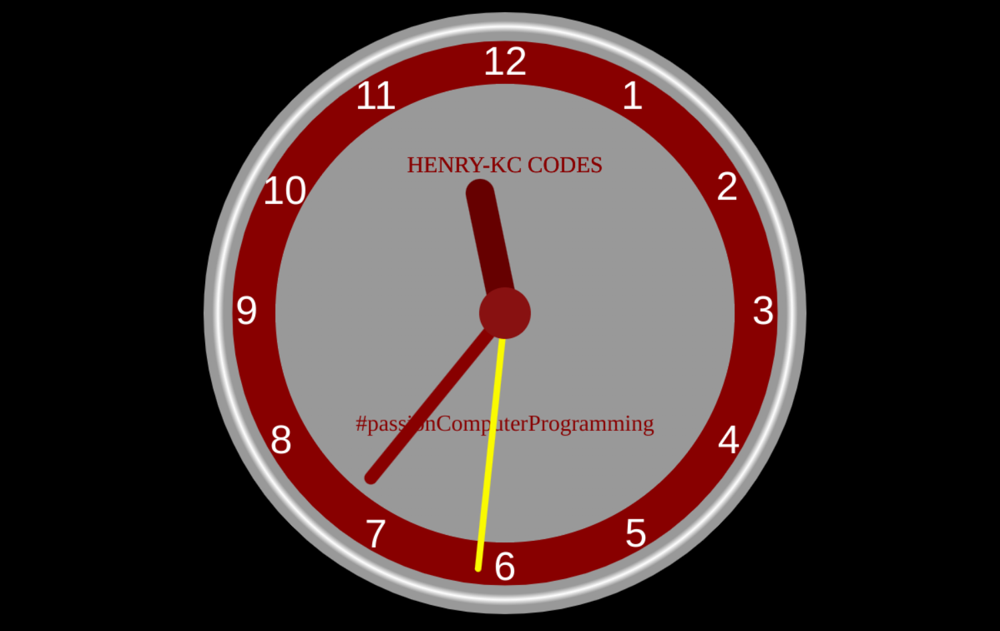

# Analogue Clock
An analog clock simulation. This project was inspired by a project I saw on w3schools when I was few months into coding. It is really efficient in keeping time.
## Built With

- HTML
- CSS
- JavaScript
- HTML/JS Canvas

## Live Demo

[Live Demo Link](https://henrykc24.github.io/analogue-clock/)

## Author

👤 **Henry Kc**

- GitHub: [@githubhandle](https://github.com/henrykc24)
- Twitter: [@twitterhandle](https://twitter.com/henrykc24)
- LinkedIn: [LinkedIn](https://linkedin.com/in/henry-kc)

## 🤝 Contributing

Contributions, issues, and feature requests are welcome!

Feel free to check the [issues page](https://github.com/HENRYKC24/analogue-clock/issues/).

## Show your support

Give a ⭐️ if you like this project!

## Acknowledgments
- I am thankful to all my fellow developers whom I reach out to whenever I have a blocker.
## 📝 License

This project is [MIT](./LICENSE) licensed.
